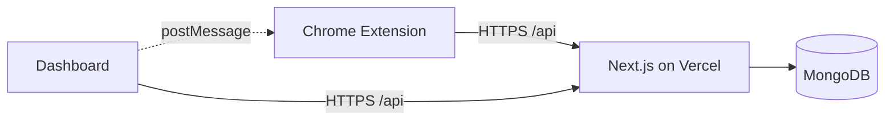

# ProdLytics

<div align="center">


*A full-stack productivity intelligence platform — Chrome extension + Next.js dashboard + MongoDB — that tracks, classifies, and transforms your browsing behavior into actionable productivity insights.*

</div>

---

## 📌 Table of Contents

- [Project Overview](#-project-overview)
- [System Architecture](#-system-architecture)
- [Core Features](#-core-features)
- [Tech Stack](#-tech-stack)
- [Project Structure](#-project-structure)
- [Setup & Installation](#-setup--installation)
- [Running the Project](#-running-the-project)
- [Chrome Extension Deep Dive](#-chrome-extension-deep-dive)
- [API Reference](#-api-reference)
- [Deployment (Vercel)](#-deployment-vercel)
- [Chrome Web Store Submission](#-chrome-web-store-submission)
- [Troubleshooting](#-troubleshooting)
- [What We Learned](#-what-we-learned)
- [Contributors](#-contributors)

---

## 🧠 Project Overview

ProdLytics is an end-to-end productivity analytics platform designed to give users genuine insight into how they spend time on the web — and tools to improve it .

The system works in three phases:

1. **Capture** — A Chrome extension (Manifest V3) silently tracks browsing activity and light interaction signals (active tab time, domain switches, scroll depth, focus events) in real time.
2. **Interpret** — A Next.js backend classifies each domain as productive, neutral, or distracting using a built-in AI-style heuristic classifier, then computes focus scores, cognitive load indicators, and hourly breakdowns.
3. **Act** — A rich dashboard gives users access to goals, blocklists, deep-work session tracking, Focus Mode, and personalized productivity insights — all in one place.

> 💡 Cognitive-style metrics are heuristic productivity indicators designed to surface patterns, not medical diagnostics.

---

## 🏗 System Architecture

```
┌─────────────────────────────────────────────────────────┐
│                     Chrome Browser                      │
│                                                         │
│  ┌──────────────────────┐   ┌─────────────────────┐    │
│  │  Chrome Extension     │   │  Dashboard (Next.js) │    │
│  │  (Manifest V3)        │   │  UI + Data Viz       │    │
│  │                       │   │                      │    │
│  │  • background.js      │   │  • Goals             │    │
│  │  • content.js         │   │  • Insights          │    │
│  │  • popup.js           │   │  • Focus Mode        │    │
│  │  • Focus Mode toggle  │   │  • Deep Work Timer   │    │
│  └────────┬─────────────┘   └──────────┬───────────┘    │
│           │  HTTPS /api                │  HTTPS /api     │
│           │  (postMessage for sync)    │                  │
└───────────┼────────────────────────────┼──────────────────┘
            │                            │
            ▼                            ▼
┌───────────────────────────────────────────────────────────┐
│                  Next.js API Routes (Vercel)               │
│                                                           │
│  /api/tracking   /api/goals   /api/focus   /api/deepwork  │
│  /api/auth       /api/tracking/stats       /api/tracking/ │
│                  hourly      cognitive-load               │
│                                                           │
│  ┌────────────────────────────────────────────────────┐  │
│  │  @prodlytics/backend (shared npm package)           │  │
│  │  • MongoDB connector (Mongoose)                     │  │
│  │  • AI-style domain classifier                       │  │
│  │  • Scoring & aggregation logic                      │  │
│  └────────────────────────────────────────────────────┘  │
└───────────────────────────┬───────────────────────────────┘
                            │
                            ▼
               ┌────────────────────────┐
               │       MongoDB          │
               │  (Atlas or local)      │
               │                        │
               │  • BrowsingSession     │
               │  • Goal                │
               │  • FocusBlock          │
               │  • DeepWorkSession     │
               │  • UserPreferences     │
               └────────────────────────┘
```



---

## ✨ Core Features

### 🔍 Browsing Activity Capture
- Tracks active tab time per domain with millisecond accuracy
- Detects domain switches and session boundaries automatically
- Monitors interaction signals: scroll depth, click events, focus/blur
- Groups sessions by date and timezone for accurate daily stats

### 🤖 AI-Style Domain Classification
- Classifies every domain as **Productive**, **Neutral**, or **Distracting**
- Uses a heuristic rule engine trained on domain reputation signals
- Handles edge cases: localhost, internal tools, new/unknown domains
- Classification improves based on user-defined blocklists and goals

### 📊 Analytics Dashboard
- **Daily stats** — total active time, productive vs distracting ratio, focus score
- **Hourly breakdown** — timezone-aware chart of activity per hour of day
- **Cognitive load series** — proxy metric for mental effort across sessions
- **Historical view** — compare today, yesterday, last week, last month

### 🎯 Goals & Blocklist
- Set daily time goals per domain or category
- Track goal progress in real time via dashboard
- Blocklist distracting sites; the extension enforces blocks during Focus Mode
- CRUD operations with instant sync to the extension

### ⏱ Deep Work Sessions
- Start a timed deep-work session from popup or dashboard
- Extension auto-activates Focus Mode during sessions
- Session history stored for trend analysis
- Configurable duration with break reminders

### 🚫 Focus Mode
- One-click activation from the Chrome extension popup
- Blocks all domains in the user's blocklist while active
- Dashboard toggles sync bidirectionally with the extension via `postMessage`
- Visual indicator in the extension popup showing mode status

### 💡 Productivity Insights
- Weekly summaries highlighting peak productivity hours
- Suggestions based on browsing pattern anomalies
- Streak tracking for goal achievement

---

## 🛠 Tech Stack

| Layer | Technology | Purpose |
|---|---|---|
| **Dashboard UI** | Next.js 16, React 19 | SSR + client-side dashboard |
| **Styling** | Tailwind CSS v4 | Utility-first design system |
| **Animations** | Framer Motion | Page transitions, chart animations |
| **Data Visualization** | D3, Recharts | Hourly charts, cognitive load series, goal rings |
| **Chrome Extension** | Manifest V3, Vite, esbuild | Browser-side tracking and Focus Mode |
| **Backend / API** | Next.js API Routes (App Router) | REST endpoints for all data operations |
| **Shared Package** | `@prodlytics/backend` (local npm) | DB connector, models, classifier — shared between API routes |
| **Database** | MongoDB + Mongoose | Persistent session, goal, and focus storage |
| **Auth** | JWT (session-based) | Lightweight auth for API route protection |
| **Deployment** | Vercel | Dashboard + API (single Next.js deployment) |
| **Build Tool (ext)** | Vite + esbuild | Fast MV3-compatible extension bundles |

---

## 📁 Project Structure

```
prodlytics/
│
├── frontend/                            # Next.js 16 app (dashboard + API routes)
│   ├── src/
│   │   ├── app/
│   │   │   ├── layout.tsx               # Root layout with providers
│   │   │   ├── page.tsx                 # Dashboard home
│   │   │   ├── goals/
│   │   │   │   └── page.tsx             # Goals management UI
│   │   │   ├── focus/
│   │   │   │   └── page.tsx             # Blocklist + Focus Mode UI
│   │   │   ├── deepwork/
│   │   │   │   └── page.tsx             # Deep work session timer UI
│   │   │   ├── insights/
│   │   │   │   └── page.tsx             # Productivity insights & summaries
│   │   │   └── api/
│   │   │       ├── tracking/
│   │   │       │   ├── route.ts         # POST /api/tracking
│   │   │       │   ├── stats/
│   │   │       │   │   └── route.ts     # GET /api/tracking/stats
│   │   │       │   ├── hourly/
│   │   │       │   │   └── route.ts     # GET /api/tracking/hourly
│   │   │       │   └── cognitive-load/
│   │   │       │       └── route.ts     # GET /api/tracking/cognitive-load
│   │   │       ├── auth/
│   │   │       │   ├── preferences/
│   │   │       │   │   └── route.ts     # GET|PUT /api/auth/preferences
│   │   │       │   └── [...nextauth]/
│   │   │       │       └── route.ts     # Google OAuth (optional)
│   │   │       ├── goals/
│   │   │       │   ├── route.ts         # GET|POST /api/goals
│   │   │       │   ├── [id]/
│   │   │       │   │   └── route.ts     # PUT|DELETE /api/goals/:id
│   │   │       │   └── progress/
│   │   │       │       └── route.ts     # GET /api/goals/progress
│   │   │       ├── focus/
│   │   │       │   └── route.ts         # GET|POST|DELETE /api/focus (blocklist)
│   │   │       └── deepwork/
│   │   │           └── route.ts         # GET|POST /api/deepwork
│   │   └── components/
│   │       ├── charts/
│   │       │   ├── HourlyChart.tsx      # D3 hourly activity bar chart
│   │       │   ├── CognitiveLoad.tsx    # Recharts cognitive load line chart
│   │       │   └── GoalRing.tsx         # Circular goal progress ring
│   │       ├── FocusModeToggle.tsx      # Sync toggle (postMessage ↔ API)
│   │       ├── DeepWorkTimer.tsx        # Countdown timer with controls
│   │       └── InsightCard.tsx          # Weekly productivity insight cards
│   ├── .env.local.example
│   ├── next.config.ts
│   ├── tailwind.config.ts
│   └── package.json
│
├── backend/                             # Shared npm package (@prodlytics/backend)
│   ├── src/
│   │   ├── db.ts                        # Mongoose connection (singleton)
│   │   ├── classifier.ts                # AI-style domain classifier
│   │   └── models/
│   │       ├── BrowsingSession.ts       # Session schema + indexes
│   │       ├── Goal.ts                  # Goal schema
│   │       ├── FocusBlock.ts            # Blocklist entry schema
│   │       ├── DeepWorkSession.ts       # Deep work session schema
│   │       └── UserPreferences.ts       # User settings schema
│   └── package.json
│
├── extension/                           # Chrome Extension (Manifest V3)
│   ├── src/
│   │   ├── background/
│   │   │   └── background.ts            # Service worker: tab tracking, session mgmt
│   │   ├── content/
│   │   │   └── content.ts               # Content script: scroll, interaction signals
│   │   ├── popup/
│   │   │   ├── popup.html               # Extension popup HTML
│   │   │   ├── popup.ts                 # Popup logic: stats, focus toggle, timer
│   │   │   └── popup.css                # Popup styles
│   │   └── utils/
│   │       ├── api.ts                   # Fetch wrapper targeting backend URL
│   │       ├── storage.ts               # chrome.storage.local helpers
│   │       └── time.ts                  # Active time calculation utilities
│   ├── manifest.json                    # MV3 manifest
│   ├── build.js                         # Vite/esbuild build config
│   ├── dist/                            # Production build output (gitignored)
│   └── package.json
│
├── docs/
│   ├── PROJECT_DOCUMENTATION.md         # Technical details and API contracts
│   ├── SRS.md                           # Software Requirements Specification
│   ├── fix_srs_encoding.py              # Fix SRS encoding after merges
│   └── chrome-web-store/
│       ├── PUBLISH_CHECKLIST.md         # Step-by-step store submission guide
│       ├── store-listing.md             # Store description copy
│       ├── privacy-policy.md            # Privacy policy mirror
│       └── screenshots/                 # Store listing screenshots (not in zip)
│
├── report.md                            # Academic project report
├── package.json                         # Root scripts (install:all, dev, build:ext)
└── README.md
```

---

## ⚙️ Setup & Installation

### Prerequisites

| Requirement | Version | Notes |
|---|---|---|
| **Node.js** | 20+ | Required for Next.js 16 |
| **npm** | 10+ | Workspace-aware installs |
| **MongoDB** | Local or Atlas | See MongoDB Atlas setup below |
| **Google Chrome** | Latest | Or any Chromium browser |
| **Git** | Any | For cloning the repo |

---

### Step 1 — Clone the Repository

```bash
git clone https://github.com/<your-username>/prodlytics.git
cd prodlytics
```

---

### Step 2 — Install All Dependencies

From the **repo root**, install dependencies for `frontend`, `backend`, and `extension` in one command:

```bash
npm run install:all
```

This runs `npm install` in all three packages and links the shared `@prodlytics/backend` package into the frontend.

---

### Step 3 — Configure Environment Variables

```bash
cp frontend/.env.local.example frontend/.env.local
```

Open `frontend/.env.local` and fill in your values: v2

```env
# ─── Required ────────────────────────────────────────
MONGO_URI=mongodb://localhost:27017/prodlytics
# OR use MongoDB Atlas:
# MONGO_URI=mongodb+srv://<user>:<password>@cluster.mongodb.net/prodlytics

JWT_SECRET=your-super-secret-jwt-key-here

# ─── Optional: Google OAuth ───────────────────────────
NEXT_PUBLIC_GOOGLE_CLIENT_ID=
GOOGLE_CLIENT_ID=
GOOGLE_CLIENT_SECRET=

# ─── Optional: UI copy overrides ─────────────────────
NEXT_PUBLIC_SUPPORT_EMAIL=support@prodlytics.app
NEXT_PUBLIC_DATA_REGION=EU
```

> ⚠️ **Never commit `.env.local` to version control.** It is already in `.gitignore`.

---

### MongoDB Atlas Setup (Recommended for Production)

1. Create a free account at [mongodb.com/cloud/atlas](https://www.mongodb.com/cloud/atlas)
2. Create a new cluster (M0 free tier is enough)
3. Under **Database Access**, create a user with read/write permissions
4. Under **Network Access**, add your IP (or `0.0.0.0/0` for Vercel deploys)
5. Click **Connect → Connect your application** and copy the connection string
6. Replace `<password>` in the URI and paste it as `MONGO_URI`

---

## 🚀 Running the Project

### Run Dashboard + Extension Dev Servers Together

From the **repo root**:

```bash
npm run dev
```

This starts both the Next.js dashboard and the extension dev server concurrently.

---

### Run Dashboard Only

```bash
cd frontend
npm run dev
```

Dashboard opens at → `http://localhost:3000`

---

### Build the Extension

```bash
cd extension
npm install
npm run build
```

Output is written to `extension/dist/`.

**For local development** (targets `localhost:3000`):

```bash
PRODLYTICS_EXTENSION_TARGET=development npm run build
```

**For production** (targets `https://prodlytics.vercel.app`):

```bash
npm run build
```

---

### Load the Extension in Chrome

1. Open `chrome://extensions` in Chrome
2. Enable **Developer mode** (toggle, top right)
3. Click **Load unpacked**
4. Select the **`extension/dist`** folder
5. The ProdLytics icon will appear in your toolbar

After any code change, re-run `npm run build` inside `extension/` and click **Reload** on the extension card in `chrome://extensions`.

---

## 🔌 Chrome Extension Deep Dive

### How the Extension Works

The extension is built with **Manifest V3**, the current Chrome extension standard. It uses a **service worker** (instead of a persistent background page) for all background logic.

#### Manifest V3 Key Concepts Used

| MV3 Feature | How ProdLytics Uses It |
|---|---|
| **Service Worker** | `background.ts` — tab tracking, session management, alarm scheduling |
| **Content Scripts** | `content.ts` — injected into every page for interaction signals |
| **`chrome.storage.local`** | Persists session data, focus state, blocklist locally |
| **`chrome.tabs` API** | Detects tab switches, URL changes, active tab focus |
| **`chrome.alarms` API** | Periodic data flush to backend (every 30 seconds) |
| **`chrome.runtime.sendMessage`** | Popup ↔ background communication |
| **`declarativeNetRequest`** | Blocks domains during Focus Mode (no background page needed) |

#### Tracking Pipeline

```
User browses → chrome.tabs.onActivated / onUpdated fires
                          │
                          ▼
             background.ts records {domain, startTime}
                          │
              User switches tab / closes tab
                          │
                          ▼
             Session ends → duration calculated
                          │
                          ▼
           chrome.storage.local buffers the session
                          │
                 chrome.alarms fires every 30s
                          │
                          ▼
             POST /api/tracking → MongoDB persisted
```

#### Popup UI

The popup (`popup.html` + `popup.ts`) provides:
- **Today's stats** — total active time, productive %, focus score
- **Top domains** — ranked by time spent today
- **Focus Mode toggle** — one click to activate/deactivate
- **Deep Work timer** — start/stop a timed session

The popup communicates with the service worker via `chrome.runtime.sendMessage` and with the dashboard via `postMessage` (when both are open in the same browser).

#### Focus Mode Implementation

When Focus Mode is activated:
1. Popup sends a message to `background.ts`
2. `background.ts` fetches the current blocklist from `chrome.storage.local`
3. Updates `declarativeNetRequest` dynamic rules to block those domains
4. Sets a badge on the extension icon: `🔴 ON`
5. Syncs state to the dashboard via a `POST /api/auth/preferences` call

---

## 📡 API Reference

All API handlers live under `frontend/src/app/api/`. For full schema contracts, see [`docs/PROJECT_DOCUMENTATION.md`](docs/PROJECT_DOCUMENTATION.md).

### Tracking

| Method | Endpoint | Description |
|---|---|---|
| `POST` | `/api/tracking` | Ingest one or more browsing sessions from the extension |
| `GET` | `/api/tracking/stats?range=today\|yesterday\|week\|month` | Aggregated stats + focus score for the selected range |
| `GET` | `/api/tracking/hourly?tz=Asia/Kolkata&dateKey=2024-06-01` | Hourly time breakdown (timezone-aware) |
| `GET` | `/api/tracking/cognitive-load` | Cognitive-load-style time series for the current day |

**POST `/api/tracking` — Request Body**

```json
{
  "sessions": [
    {
      "domain": "github.com",
      "startTime": "2024-06-01T09:15:00Z",
      "endTime": "2024-06-01T09:43:00Z",
      "scrollDepth": 0.72,
      "clickCount": 14
    }
  ]
}
```

**GET `/api/tracking/stats` — Response**

```json
{
  "totalActiveMs": 18540000,
  "productiveMs": 12200000,
  "distractingMs": 3100000,
  "neutralMs": 3240000,
  "focusScore": 74,
  "topDomains": [
    { "domain": "github.com", "ms": 5400000, "classification": "productive" },
    { "domain": "youtube.com", "ms": 2700000, "classification": "distracting" }
  ]
}
```

---

### Goals

| Method | Endpoint | Description |
|---|---|---|
| `GET` | `/api/goals` | List all goals for the authenticated user |
| `POST` | `/api/goals` | Create a new goal |
| `PUT` | `/api/goals/:id` | Update an existing goal |
| `DELETE` | `/api/goals/:id` | Delete a goal |
| `GET` | `/api/goals/progress` | Today's progress toward each active goal |

**POST `/api/goals` — Request Body**

```json
{
  "name": "Limit YouTube",
  "domain": "youtube.com",
  "limitMs": 1800000,
  "type": "limit"
}
```

---

### Focus (Blocklist)

| Method | Endpoint | Description |
|---|---|---|
| `GET` | `/api/focus` | Get the user's blocklist |
| `POST` | `/api/focus` | Add a domain to the blocklist |
| `DELETE` | `/api/focus` | Remove a domain from the blocklist |

---

### Deep Work Sessions

| Method | Endpoint | Description |
|---|---|---|
| `GET` | `/api/deepwork` | Get all deep work sessions |
| `POST` | `/api/deepwork` | Record a completed (or in-progress) deep work session |

---

### Auth / Preferences

| Method | Endpoint | Description |
|---|---|---|
| `GET` | `/api/auth/preferences` | Fetch focus mode settings and timer preferences |
| `PUT` | `/api/auth/preferences` | Update preferences (focus duration, break duration, etc.) |

---

## 🚀 Deployment (Vercel)

The dashboard and REST API deploy as a **single Next.js app** on Vercel. The `backend/` package is bundled into the deployment via API routes — you do **not** need a separate server.

### Steps

1. Push the repo to GitHub
2. Import the project at [vercel.com/new](https://vercel.com/new)
3. Set **Root Directory** to `frontend/`
4. Add environment variables under **Project → Settings → Environment Variables**:
   - `MONGO_URI`
   - `JWT_SECRET`
   - `NEXT_PUBLIC_GOOGLE_CLIENT_ID` / `GOOGLE_CLIENT_ID` (if using OAuth)
5. Deploy — Vercel auto-detects Next.js

> After deploying, rebuild your extension with `npm run build` (production target) so it points to your live Vercel URL.

---

## 🏪 Chrome Web Store Submission

### Build the Store Package

From `extension/`:

```bash
npm run build
npm run zip:store
```

This creates **`extension/prodlytics-extension-store.zip`** with the `dist/` contents at the zip root — the exact shape required by the Chrome Web Store Developer Dashboard.

> The zip path is in `.gitignore`. Regenerate it before every submission.

### Submission Checklist

See the full step-by-step guide: [`docs/chrome-web-store/PUBLISH_CHECKLIST.md`](docs/chrome-web-store/PUBLISH_CHECKLIST.md)

**Quick checklist:**
- [ ] Extension loads from `extension/dist` without errors
- [ ] Production build targets your deployed Vercel URL
- [ ] `manifest.json` version number is bumped
- [ ] Store screenshots are in `docs/chrome-web-store/screenshots/` (upload manually in the dashboard — do not include in the zip)
- [ ] Privacy policy URL is live and matches `docs/chrome-web-store/privacy-policy.md`
- [ ] All required permissions in `manifest.json` are justified in the store listing

---

## 🔧 Troubleshooting

### MongoDB connection fails

- Confirm `MONGO_URI` in `frontend/.env.local` (local) or Vercel environment (production)
- Check MongoDB Atlas IP allowlist under **Network Access** — add `0.0.0.0/0` for Vercel serverless
- Verify Atlas username/password are URL-encoded (e.g., `@` → `%40`)

### Extension not syncing with dashboard

- **Local:** Make sure the dashboard is running at `http://localhost:3000`, then rebuild the extension with the dev target:
  ```bash
  PRODLYTICS_EXTENSION_TARGET=development npm run build
  ```
- **Production:** Run `npm run build` (default, targets Vercel URL), then reload the extension on `chrome://extensions`
- Check the browser console in the extension popup (right-click → Inspect) for fetch errors

### JWT / auth errors

- Ensure `JWT_SECRET` is set in the same environment as the Next.js server
- For local development, it must be in `frontend/.env.local`
- For production, it must be set in Vercel's environment variables

### SRS.md shows escaped newlines after a merge

```bash
python docs/fix_srs_encoding.py
```

### Extension builds but Focus Mode doesn't block sites

- Check that `declarativeNetRequest` permission is in `manifest.json`
- Reload the extension after every build on `chrome://extensions`
- Verify the blocklist is non-empty via `GET /api/focus` in the browser

### CORS errors when extension calls the API

- CORS is configured for extension and dashboard origins in the Next.js API routes
- If you add a new frontend origin, update the CORS allowed origins in `frontend/next.config.ts`

---

## 📚 What We Learned

Building ProdLytics taught us what it means to ship a **real product** — not just a demo:

- **Chrome Manifest V3 is genuinely different.** Migrating from persistent background pages to service workers forced us to rethink our entire session tracking architecture. State can't live in memory — everything has to be persisted to `chrome.storage` and flushed on alarms.

- **`declarativeNetRequest` is powerful but strict.** Blocking domains in MV3 without a background page requires well-formed static and dynamic rules. Debugging why a site wasn't being blocked (and finding a typo in a rule) cost us hours.

- **Full-stack state sync is hard.** Keeping the extension popup, dashboard, and MongoDB in sync — especially with Focus Mode — required careful sequencing: local storage first, then API call, then UI update. Getting it wrong meant stale UI states and user confusion.

- **Monorepo workspace management pays off.** Sharing the `@prodlytics/backend` package across API routes meant zero duplication of Mongoose models. Setting it up with npm workspaces was the right call even though it added early overhead.

- **Real users care about performance, not features.** Our initial dashboard was slow because every page load triggered a fresh MongoDB aggregation. We added indexed queries and server-side caching, and perceived load time dropped dramatically.

- **Design for the extension popup is its own discipline.** 400px wide, no scrolling, must be scannable in 2 seconds. We went through four popup redesigns before landing on something that felt intuitive.

---

## 👥 Contributors

| Name | GitHub |
|---|---|
| Jan Adnan Farooq | [@adnaan-dev](https://github.com/adnaan-dev) |
| Sradha Ram | [@sradha2474](https://github.com/sradha2474) |
| Akeem Ali | [@akeem786](https://github.com/akeem786) |
| Saqib Mokhtar | [@saqibmokhtar884](https://github.com/saqibmokhtar884) |
| Mohammad Aakib Bhat | [@bhataakib02](https://github.com/bhataakib02) |
| Satakshik Chaurasia | [@satakshik-chaurasia](https://github.com/satakshik-chaurasia) |

---

## 📄 License

This project is developed as part of an academic group project at **C.V. Raman Global University**.  
See the `LICENSE` file at the project root for terms.

---

<div align="center">
  <i>Built with ❤️ by the ProdLytics team — powered by Next.js, MongoDB, Chrome MV3, and Tailwind CSS</i>
</div>
